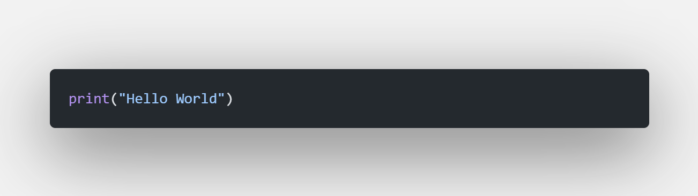

<!-- DO NOT EDIT: generated by Nix -->

# 👋 Hi I'm akaz.

[^1]

## Short Explanation

This profile README is generated from the shared Nix aggregate, which combines the hand-maintained profile contract with the normalized repository snapshot.
It stays presentation-focused, deterministic, and aware that this generator repository is part of the observed input state, so it can appear in derived sections when present in `repos.nix`.

Current aggregate snapshot: 132 repositories, 65 stars across the observed set.

osu!

## Featured Repositories

- [pixelart](https://github.com/akazdayo/pixelart), 35 stars, primary language: Python, pushed 2026-02-08T07:58:20Z, topics: converter, pixelart
- [AutoYukkuri](https://github.com/akazdayo/AutoYukkuri), 13 stars, primary language: Python, pushed 2024-07-26T05:35:12Z, topics: none listed
- [YUKKURIKANIKATOOL](https://github.com/akazdayo/YUKKURIKANIKATOOL), 3 stars, primary language: Python, pushed 2023-02-20T01:45:29Z, topics: none listed
- [code-museum-server](https://github.com/akazdayo/code-museum-server), 2 stars, primary language: TypeScript, pushed 2025-03-05T06:34:16Z, topics: none listed
- [vrchat-web-rtsp](https://github.com/akazdayo/vrchat-web-rtsp), 2 stars, primary language: TypeScript, pushed 2026-02-04T07:24:59Z, topics: none listed
- [addition-bot](https://github.com/akazdayo/addition-bot), 1 star, primary language: Python, pushed 2023-07-04T08:25:41Z, topics: none listed
- [aikyo-package-manager](https://github.com/akazdayo/aikyo-package-manager), 1 star, primary language: Rust, pushed 2025-09-13T09:19:08Z, topics: none listed
- [expression](https://github.com/akazdayo/expression), 1 star, primary language: Gleam, pushed 2026-03-07T00:39:16Z, topics: none listed
- [kawaii-nostr-web](https://github.com/akazdayo/kawaii-nostr-web), 1 star, primary language: TypeScript, pushed 2025-12-18T17:38:30Z, topics: none listed
- [lastfm-rpc-rs](https://github.com/akazdayo/lastfm-rpc-rs), 1 star, primary language: Rust, pushed 2024-12-18T19:06:28Z, topics: none listed
- [mitarasi-bot](https://github.com/akazdayo/mitarasi-bot), 1 star, primary language: Python, pushed 2023-08-17T02:09:26Z, topics: none listed
- [nix-configs](https://github.com/akazdayo/nix-configs), 1 star, primary language: Nix, pushed 2026-03-03T15:21:43Z, topics: none listed
- [nostr-profile](https://github.com/akazdayo/nostr-profile), 1 star, primary language: TypeScript, pushed 2025-04-21T07:15:20Z, topics: none listed
- [obsidian-nostr-sync](https://github.com/akazdayo/obsidian-nostr-sync), 1 star, primary language: TypeScript, pushed 2025-10-30T08:02:28Z, topics: none listed
- [pixelart-modules](https://github.com/akazdayo/pixelart-modules), 1 star, primary language: Rust, pushed 2025-03-31T04:19:22Z, topics: none listed
- [10seconds](https://github.com/akazdayo/10seconds), 0 stars, primary language: JavaScript, pushed 2021-10-07T09:37:13Z, topics: none listed
- [2026-01-31](https://github.com/akazdayo/2026-01-31), 0 stars, primary language: TypeScript, pushed 2026-01-31T06:07:04Z, topics: none listed
- [AutoYukkuri-CPU](https://github.com/akazdayo/AutoYukkuri-CPU), 0 stars, primary language: Python, pushed 2023-11-17T10:56:59Z, topics: none listed
- [Bingo](https://github.com/akazdayo/Bingo), 0 stars, primary language: HTML, pushed 2023-09-14T05:28:06Z, topics: none listed
- [ColorfulSE](https://github.com/akazdayo/ColorfulSE), 0 stars, primary language: `null`, pushed 2024-03-03T15:32:23Z, topics: none listed
- [LT-slides](https://github.com/akazdayo/LT-slides), 0 stars, primary language: Nix, pushed 2026-02-13T09:08:21Z, topics: none listed
- [MathGame](https://github.com/akazdayo/MathGame), 0 stars, primary language: Python, pushed 2024-04-25T12:53:18Z, topics: none listed
- [MathGame-Rust](https://github.com/akazdayo/MathGame-Rust), 0 stars, primary language: Rust, pushed 2023-12-26T11:20:34Z, topics: none listed
- [MusicArcade2](https://github.com/akazdayo/MusicArcade2), 0 stars, primary language: Haxe, pushed 2024-05-19T15:52:37Z, topics: none listed
- [ScratchArt](https://github.com/akazdayo/ScratchArt), 0 stars, primary language: Python, pushed 2023-11-10T01:08:52Z, topics: none listed
- [aikyo-aituber](https://github.com/akazdayo/aikyo-aituber), 0 stars, primary language: TypeScript, pushed 2025-10-07T17:06:47Z, topics: none listed
- [aikyo-aituberkit-bridge](https://github.com/akazdayo/aikyo-aituberkit-bridge), 0 stars, primary language: TypeScript, pushed 2025-10-11T08:23:59Z, topics: none listed
- [aikyo-basic-template](https://github.com/akazdayo/aikyo-basic-template), 0 stars, primary language: TypeScript, pushed 2025-08-29T12:14:20Z, topics: none listed
- [aikyo-blank-template](https://github.com/akazdayo/aikyo-blank-template), 0 stars, primary language: TypeScript, pushed 2025-08-23T23:46:49Z, topics: none listed
- [aikyo-discord](https://github.com/akazdayo/aikyo-discord), 0 stars, primary language: TypeScript, pushed 2025-11-01T08:19:44Z, topics: none listed
- [aikyo-template](https://github.com/akazdayo/aikyo-template), 0 stars, primary language: TypeScript, pushed 2025-10-20T10:15:51Z, topics: none listed
- [aikyo-yukkuri](https://github.com/akazdayo/aikyo-yukkuri), 0 stars, primary language: TypeScript, pushed 2025-10-19T09:14:36Z, topics: none listed
- [aituber-kit-aikyo-demo](https://github.com/akazdayo/aituber-kit-aikyo-demo), 0 stars, primary language: TypeScript, pushed 2025-10-02T04:34:07Z, topics: none listed
- [akazdayo](https://github.com/akazdayo/akazdayo), 0 stars, primary language: `null`, pushed 2025-10-26T06:06:46Z, topics: config, github-config
- [akazdayo.github.io](https://github.com/akazdayo/akazdayo.github.io), 0 stars, primary language: `null`, pushed 2025-11-04T16:00:25Z, topics: none listed
- [articles](https://github.com/akazdayo/articles), 0 stars, primary language: Nix, pushed 2025-12-30T15:10:22Z, topics: none listed
- [auto-yukkuri-web](https://github.com/akazdayo/auto-yukkuri-web), 0 stars, primary language: JavaScript, pushed 2025-11-16T11:33:24Z, topics: none listed
- [centerized-aikyo](https://github.com/akazdayo/centerized-aikyo), 0 stars, primary language: Rust, pushed 2025-12-10T11:33:34Z, topics: none listed
- [chrome-whisper](https://github.com/akazdayo/chrome-whisper), 0 stars, primary language: TypeScript, pushed 2024-07-29T16:47:33Z, topics: none listed
- [digitalocean-nix-tf](https://github.com/akazdayo/digitalocean-nix-tf), 0 stars, primary language: Nix, pushed 2026-03-10T04:47:46Z, topics: none listed
- [disco-chan](https://github.com/akazdayo/disco-chan), 0 stars, primary language: TypeScript, pushed 2024-10-31T10:52:49Z, topics: none listed
- [discord-meeting-note](https://github.com/akazdayo/discord-meeting-note), 0 stars, primary language: Nix, pushed 2026-03-09T13:48:45Z, topics: none listed
- [dotfiles](https://github.com/akazdayo/dotfiles), 0 stars, primary language: `null`, pushed 2025-04-02T12:13:52Z, topics: none listed
- [enhanced-tetris](https://github.com/akazdayo/enhanced-tetris), 0 stars, primary language: JavaScript, pushed 2025-06-21T15:43:54Z, topics: none listed
- [ethereum-counter-app](https://github.com/akazdayo/ethereum-counter-app), 0 stars, primary language: TypeScript, pushed 2026-01-12T11:38:46Z, topics: none listed
- [fbx2video](https://github.com/akazdayo/fbx2video), 0 stars, primary language: Python, pushed 2025-08-17T09:50:31Z, topics: none listed
- [homebrew-tap](https://github.com/akazdayo/homebrew-tap), 0 stars, primary language: Ruby, pushed 2025-09-13T09:22:59Z, topics: none listed
- [hotkey-audio](https://github.com/akazdayo/hotkey-audio), 0 stars, primary language: Rust, pushed 2024-02-25T02:10:43Z, topics: none listed
- [img2asciivideo](https://github.com/akazdayo/img2asciivideo), 0 stars, primary language: Rust, pushed 2024-01-24T04:41:32Z, topics: none listed
- [karicommu](https://github.com/akazdayo/karicommu), 0 stars, primary language: Astro, pushed 2025-04-10T06:27:40Z, topics: none listed
- [lastfm-rpc](https://github.com/akazdayo/lastfm-rpc), 0 stars, primary language: Rust, pushed 2024-12-07T11:32:16Z, topics: none listed
- [live-comment-ai](https://github.com/akazdayo/live-comment-ai), 0 stars, primary language: Python, pushed 2024-06-16T03:45:54Z, topics: none listed
- [llm-speaker-test](https://github.com/akazdayo/llm-speaker-test), 0 stars, primary language: TypeScript, pushed 2025-08-30T12:38:58Z, topics: none listed
- [markdown-parser-nix](https://github.com/akazdayo/markdown-parser-nix), 0 stars, primary language: Nix, pushed 2026-02-21T06:04:54Z, topics: none listed
- [mc-server-auto-launch](https://github.com/akazdayo/mc-server-auto-launch), 0 stars, primary language: Go, pushed 2024-08-02T06:51:07Z, topics: none listed
- [minecraft-docker](https://github.com/akazdayo/minecraft-docker), 0 stars, primary language: Dockerfile, pushed 2024-07-22T04:05:44Z, topics: none listed
- [minecraft-proxy](https://github.com/akazdayo/minecraft-proxy), 0 stars, primary language: Nix, pushed 2026-03-11T04:28:20Z, topics: none listed
- [misstor](https://github.com/akazdayo/misstor), 0 stars, primary language: TypeScript, pushed 2026-01-07T10:26:17Z, topics: none listed
- [my-portfolio](https://github.com/akazdayo/my-portfolio), 0 stars, primary language: TypeScript, pushed 2026-02-22T08:36:05Z, topics: none listed
- [nix-dotenv](https://github.com/akazdayo/nix-dotenv), 0 stars, primary language: Nix, pushed 2025-10-09T06:15:12Z, topics: none listed
- [nost-profile2](https://github.com/akazdayo/nost-profile2), 0 stars, primary language: TypeScript, pushed 2025-11-18T10:52:47Z, topics: none listed
- [nostr-grass](https://github.com/akazdayo/nostr-grass), 0 stars, primary language: HTML, pushed 2025-12-18T17:27:21Z, topics: none listed
- [nostr-humanize-bot](https://github.com/akazdayo/nostr-humanize-bot), 0 stars, primary language: Python, pushed 2026-01-08T12:04:02Z, topics: none listed
- [nostr-kind1-csv](https://github.com/akazdayo/nostr-kind1-csv), 0 stars, primary language: Svelte, pushed 2025-10-25T16:43:28Z, topics: none listed
- [nostr-mcp](https://github.com/akazdayo/nostr-mcp), 0 stars, primary language: `null`, pushed 2025-07-08T06:20:44Z, topics: none listed
- [nostr-nip05-template](https://github.com/akazdayo/nostr-nip05-template), 0 stars, primary language: `null`, pushed 2025-11-04T16:03:42Z, topics: none listed
- [nostr-profile-embed](https://github.com/akazdayo/nostr-profile-embed), 0 stars, primary language: TypeScript, pushed 2025-04-14T08:01:25Z, topics: none listed
- [nostr-shrine](https://github.com/akazdayo/nostr-shrine), 0 stars, primary language: JavaScript, pushed 2025-10-11T07:08:06Z, topics: none listed
- [nostr-summary-bot](https://github.com/akazdayo/nostr-summary-bot), 0 stars, primary language: TypeScript, pushed 2025-11-17T14:57:26Z, topics: none listed
- [nostr-workers-relay](https://github.com/akazdayo/nostr-workers-relay), 0 stars, primary language: TypeScript, pushed 2025-09-27T09:00:41Z, topics: none listed
- [nuitka-actions-test](https://github.com/akazdayo/nuitka-actions-test), 0 stars, primary language: `null`, pushed 2023-12-21T03:59:15Z, topics: none listed
- [openclaw-do-nix](https://github.com/akazdayo/openclaw-do-nix), 0 stars, primary language: Nix, pushed 2026-03-11T04:50:08Z, topics: none listed
- [pdf-highlighter](https://github.com/akazdayo/pdf-highlighter), 0 stars, primary language: Python, pushed 2025-04-07T15:09:19Z, topics: none listed
- [physiquest-share](https://github.com/akazdayo/physiquest-share), 0 stars, primary language: TypeScript, pushed 2025-03-22T06:10:26Z, topics: none listed
- [pixelart-api](https://github.com/akazdayo/pixelart-api), 0 stars, primary language: Python, pushed 2025-04-26T15:01:03Z, topics: none listed
- [pixelart-astro](https://github.com/akazdayo/pixelart-astro), 0 stars, primary language: Astro, pushed 2025-04-08T09:00:58Z, topics: none listed
- [pixelart-cam](https://github.com/akazdayo/pixelart-cam), 0 stars, primary language: Python, pushed 2025-04-23T07:43:21Z, topics: none listed
- [pixelart-realtime-tauri](https://github.com/akazdayo/pixelart-realtime-tauri), 0 stars, primary language: TypeScript, pushed 2025-04-26T22:49:51Z, topics: none listed
- [pyo3-streamlit-example](https://github.com/akazdayo/pyo3-streamlit-example), 0 stars, primary language: `null`, pushed 2024-12-18T15:51:59Z, topics: none listed
- [quiz-app](https://github.com/akazdayo/quiz-app), 0 stars, primary language: TypeScript, pushed 2025-07-08T03:41:17Z, topics: none listed
- [redirect-workers](https://github.com/akazdayo/redirect-workers), 0 stars, primary language: TypeScript, pushed 2025-09-19T17:49:03Z, topics: none listed
- [rem-zombie-twitter](https://github.com/akazdayo/rem-zombie-twitter), 0 stars, primary language: JavaScript, pushed 2024-02-01T09:04:52Z, topics: none listed
- [save-the-discord](https://github.com/akazdayo/save-the-discord), 0 stars, primary language: Python, pushed 2024-10-24T04:59:54Z, topics: none listed
- [smart-event](https://github.com/akazdayo/smart-event), 0 stars, primary language: TypeScript, pushed 2025-03-14T15:58:27Z, topics: none listed
- [soundboardbot](https://github.com/akazdayo/soundboardbot), 0 stars, primary language: Rust, pushed 2025-12-21T09:37:08Z, topics: none listed
- [spinner_omiikuji](https://github.com/akazdayo/spinner_omiikuji), 0 stars, primary language: Python, pushed 2023-02-07T08:51:37Z, topics: none listed
- [stellar-appview](https://github.com/akazdayo/stellar-appview), 0 stars, primary language: `null`, pushed 2024-12-21T01:53:32Z, topics: none listed
- [tailwind-test-akazdayo](https://github.com/akazdayo/tailwind-test-akazdayo), 0 stars, primary language: HTML, pushed 2023-07-12T05:25:31Z, topics: none listed
- [tds-farm-theory-value](https://github.com/akazdayo/tds-farm-theory-value), 0 stars, primary language: Python, pushed 2023-07-29T14:07:31Z, topics: none listed
- [tor-middle-relay.nix](https://github.com/akazdayo/tor-middle-relay.nix), 0 stars, primary language: Nix, pushed 2026-03-10T04:33:58Z, topics: none listed
- [url-abstract](https://github.com/akazdayo/url-abstract), 0 stars, primary language: Nix, pushed 2025-07-03T13:02:26Z, topics: none listed
- [uzu-lab_site](https://github.com/akazdayo/uzu-lab_site), 0 stars, primary language: HTML, pushed 2023-10-07T04:19:38Z, topics: none listed
- [voicechanger](https://github.com/akazdayo/voicechanger), 0 stars, primary language: `null`, pushed 2024-07-11T01:14:50Z, topics: none listed
- [vrchat-log-watcher](https://github.com/akazdayo/vrchat-log-watcher), 0 stars, primary language: Rust, pushed 2025-11-18T15:34:57Z, topics: none listed
- [webcam-tracking](https://github.com/akazdayo/webcam-tracking), 0 stars, primary language: `null`, pushed 2024-03-14T08:31:26Z, topics: none listed
- [wordwolf-discord](https://github.com/akazdayo/wordwolf-discord), 0 stars, primary language: `null`, pushed 2024-08-10T06:35:51Z, topics: none listed

## Language Trends

- TypeScript: 34 repos
- `null`: 32 repos
- Python: 22 repos
- Nix: 11 repos
- Rust: 11 repos
- HTML: 6 repos
- JavaScript: 5 repos
- Astro: 2 repos
- Svelte: 2 repos
- C++: 1 repo
- Dockerfile: 1 repo
- Gleam: 1 repo
- Go: 1 repo
- Haxe: 1 repo
- Ruby: 1 repo
- Vue: 1 repo

## Topic Trends

- config: 1 repo
- converter: 1 repo
- github-config: 1 repo
- pixelart: 1 repo

## Recent Active Projects

- [openclaw-do-nix](https://github.com/akazdayo/openclaw-do-nix), 0 stars, primary language: Nix, pushed 2026-03-11T04:50:08Z, topics: none listed
- [minecraft-proxy](https://github.com/akazdayo/minecraft-proxy), 0 stars, primary language: Nix, pushed 2026-03-11T04:28:20Z, topics: none listed
- [digitalocean-nix-tf](https://github.com/akazdayo/digitalocean-nix-tf), 0 stars, primary language: Nix, pushed 2026-03-10T04:47:46Z, topics: none listed
- [tor-middle-relay.nix](https://github.com/akazdayo/tor-middle-relay.nix), 0 stars, primary language: Nix, pushed 2026-03-10T04:33:58Z, topics: none listed
- [discord-meeting-note](https://github.com/akazdayo/discord-meeting-note), 0 stars, primary language: Nix, pushed 2026-03-09T13:48:45Z, topics: none listed
- [expression](https://github.com/akazdayo/expression), 1 star, primary language: Gleam, pushed 2026-03-07T00:39:16Z, topics: none listed
- [nix-configs](https://github.com/akazdayo/nix-configs), 1 star, primary language: Nix, pushed 2026-03-03T15:21:43Z, topics: none listed
- [my-portfolio](https://github.com/akazdayo/my-portfolio), 0 stars, primary language: TypeScript, pushed 2026-02-22T08:36:05Z, topics: none listed
- [markdown-parser-nix](https://github.com/akazdayo/markdown-parser-nix), 0 stars, primary language: Nix, pushed 2026-02-21T06:04:54Z, topics: none listed
- [LT-slides](https://github.com/akazdayo/LT-slides), 0 stars, primary language: Nix, pushed 2026-02-13T09:08:21Z, topics: none listed
- [pixelart](https://github.com/akazdayo/pixelart), 35 stars, primary language: Python, pushed 2026-02-08T07:58:20Z, topics: converter, pixelart
- [vrchat-web-rtsp](https://github.com/akazdayo/vrchat-web-rtsp), 2 stars, primary language: TypeScript, pushed 2026-02-04T07:24:59Z, topics: none listed
- [2026-01-31](https://github.com/akazdayo/2026-01-31), 0 stars, primary language: TypeScript, pushed 2026-01-31T06:07:04Z, topics: none listed
- [ethereum-counter-app](https://github.com/akazdayo/ethereum-counter-app), 0 stars, primary language: TypeScript, pushed 2026-01-12T11:38:46Z, topics: none listed
- [nostr-humanize-bot](https://github.com/akazdayo/nostr-humanize-bot), 0 stars, primary language: Python, pushed 2026-01-08T12:04:02Z, topics: none listed
- [misstor](https://github.com/akazdayo/misstor), 0 stars, primary language: TypeScript, pushed 2026-01-07T10:26:17Z, topics: none listed
- [articles](https://github.com/akazdayo/articles), 0 stars, primary language: Nix, pushed 2025-12-30T15:10:22Z, topics: none listed
- [soundboardbot](https://github.com/akazdayo/soundboardbot), 0 stars, primary language: Rust, pushed 2025-12-21T09:37:08Z, topics: none listed
- [kawaii-nostr-web](https://github.com/akazdayo/kawaii-nostr-web), 1 star, primary language: TypeScript, pushed 2025-12-18T17:38:30Z, topics: none listed
- [nostr-grass](https://github.com/akazdayo/nostr-grass), 0 stars, primary language: HTML, pushed 2025-12-18T17:27:21Z, topics: none listed
- [centerized-aikyo](https://github.com/akazdayo/centerized-aikyo), 0 stars, primary language: Rust, pushed 2025-12-10T11:33:34Z, topics: none listed
- [vrchat-log-watcher](https://github.com/akazdayo/vrchat-log-watcher), 0 stars, primary language: Rust, pushed 2025-11-18T15:34:57Z, topics: none listed
- [nost-profile2](https://github.com/akazdayo/nost-profile2), 0 stars, primary language: TypeScript, pushed 2025-11-18T10:52:47Z, topics: none listed
- [nostr-summary-bot](https://github.com/akazdayo/nostr-summary-bot), 0 stars, primary language: TypeScript, pushed 2025-11-17T14:57:26Z, topics: none listed
- [auto-yukkuri-web](https://github.com/akazdayo/auto-yukkuri-web), 0 stars, primary language: JavaScript, pushed 2025-11-16T11:33:24Z, topics: none listed
- [nostr-nip05-template](https://github.com/akazdayo/nostr-nip05-template), 0 stars, primary language: `null`, pushed 2025-11-04T16:03:42Z, topics: none listed
- [akazdayo.github.io](https://github.com/akazdayo/akazdayo.github.io), 0 stars, primary language: `null`, pushed 2025-11-04T16:00:25Z, topics: none listed
- [aikyo-discord](https://github.com/akazdayo/aikyo-discord), 0 stars, primary language: TypeScript, pushed 2025-11-01T08:19:44Z, topics: none listed
- [obsidian-nostr-sync](https://github.com/akazdayo/obsidian-nostr-sync), 1 star, primary language: TypeScript, pushed 2025-10-30T08:02:28Z, topics: none listed
- [akazdayo](https://github.com/akazdayo/akazdayo), 0 stars, primary language: `null`, pushed 2025-10-26T06:06:46Z, topics: config, github-config
- [nostr-kind1-csv](https://github.com/akazdayo/nostr-kind1-csv), 0 stars, primary language: Svelte, pushed 2025-10-25T16:43:28Z, topics: none listed
- [aikyo-template](https://github.com/akazdayo/aikyo-template), 0 stars, primary language: TypeScript, pushed 2025-10-20T10:15:51Z, topics: none listed
- [aikyo-yukkuri](https://github.com/akazdayo/aikyo-yukkuri), 0 stars, primary language: TypeScript, pushed 2025-10-19T09:14:36Z, topics: none listed
- [aikyo-aituberkit-bridge](https://github.com/akazdayo/aikyo-aituberkit-bridge), 0 stars, primary language: TypeScript, pushed 2025-10-11T08:23:59Z, topics: none listed
- [nostr-shrine](https://github.com/akazdayo/nostr-shrine), 0 stars, primary language: JavaScript, pushed 2025-10-11T07:08:06Z, topics: none listed
- [nix-dotenv](https://github.com/akazdayo/nix-dotenv), 0 stars, primary language: Nix, pushed 2025-10-09T06:15:12Z, topics: none listed
- [aikyo-aituber](https://github.com/akazdayo/aikyo-aituber), 0 stars, primary language: TypeScript, pushed 2025-10-07T17:06:47Z, topics: none listed
- [aituber-kit-aikyo-demo](https://github.com/akazdayo/aituber-kit-aikyo-demo), 0 stars, primary language: TypeScript, pushed 2025-10-02T04:34:07Z, topics: none listed
- [nostr-workers-relay](https://github.com/akazdayo/nostr-workers-relay), 0 stars, primary language: TypeScript, pushed 2025-09-27T09:00:41Z, topics: none listed
- [redirect-workers](https://github.com/akazdayo/redirect-workers), 0 stars, primary language: TypeScript, pushed 2025-09-19T17:49:03Z, topics: none listed
- [homebrew-tap](https://github.com/akazdayo/homebrew-tap), 0 stars, primary language: Ruby, pushed 2025-09-13T09:22:59Z, topics: none listed
- [aikyo-package-manager](https://github.com/akazdayo/aikyo-package-manager), 1 star, primary language: Rust, pushed 2025-09-13T09:19:08Z, topics: none listed
- [llm-speaker-test](https://github.com/akazdayo/llm-speaker-test), 0 stars, primary language: TypeScript, pushed 2025-08-30T12:38:58Z, topics: none listed
- [aikyo-basic-template](https://github.com/akazdayo/aikyo-basic-template), 0 stars, primary language: TypeScript, pushed 2025-08-29T12:14:20Z, topics: none listed
- [aikyo-blank-template](https://github.com/akazdayo/aikyo-blank-template), 0 stars, primary language: TypeScript, pushed 2025-08-23T23:46:49Z, topics: none listed
- [fbx2video](https://github.com/akazdayo/fbx2video), 0 stars, primary language: Python, pushed 2025-08-17T09:50:31Z, topics: none listed
- [nostr-mcp](https://github.com/akazdayo/nostr-mcp), 0 stars, primary language: `null`, pushed 2025-07-08T06:20:44Z, topics: none listed
- [quiz-app](https://github.com/akazdayo/quiz-app), 0 stars, primary language: TypeScript, pushed 2025-07-08T03:41:17Z, topics: none listed
- [url-abstract](https://github.com/akazdayo/url-abstract), 0 stars, primary language: Nix, pushed 2025-07-03T13:02:26Z, topics: none listed
- [enhanced-tetris](https://github.com/akazdayo/enhanced-tetris), 0 stars, primary language: JavaScript, pushed 2025-06-21T15:43:54Z, topics: none listed
- [pixelart-realtime-tauri](https://github.com/akazdayo/pixelart-realtime-tauri), 0 stars, primary language: TypeScript, pushed 2025-04-26T22:49:51Z, topics: none listed
- [pixelart-api](https://github.com/akazdayo/pixelart-api), 0 stars, primary language: Python, pushed 2025-04-26T15:01:03Z, topics: none listed
- [pixelart-cam](https://github.com/akazdayo/pixelart-cam), 0 stars, primary language: Python, pushed 2025-04-23T07:43:21Z, topics: none listed
- [nostr-profile](https://github.com/akazdayo/nostr-profile), 1 star, primary language: TypeScript, pushed 2025-04-21T07:15:20Z, topics: none listed
- [nostr-profile-embed](https://github.com/akazdayo/nostr-profile-embed), 0 stars, primary language: TypeScript, pushed 2025-04-14T08:01:25Z, topics: none listed
- [karicommu](https://github.com/akazdayo/karicommu), 0 stars, primary language: Astro, pushed 2025-04-10T06:27:40Z, topics: none listed
- [pixelart-astro](https://github.com/akazdayo/pixelart-astro), 0 stars, primary language: Astro, pushed 2025-04-08T09:00:58Z, topics: none listed
- [pdf-highlighter](https://github.com/akazdayo/pdf-highlighter), 0 stars, primary language: Python, pushed 2025-04-07T15:09:19Z, topics: none listed
- [dotfiles](https://github.com/akazdayo/dotfiles), 0 stars, primary language: `null`, pushed 2025-04-02T12:13:52Z, topics: none listed
- [pixelart-modules](https://github.com/akazdayo/pixelart-modules), 1 star, primary language: Rust, pushed 2025-03-31T04:19:22Z, topics: none listed
- [physiquest-share](https://github.com/akazdayo/physiquest-share), 0 stars, primary language: TypeScript, pushed 2025-03-22T06:10:26Z, topics: none listed
- [smart-event](https://github.com/akazdayo/smart-event), 0 stars, primary language: TypeScript, pushed 2025-03-14T15:58:27Z, topics: none listed
- [code-museum-server](https://github.com/akazdayo/code-museum-server), 2 stars, primary language: TypeScript, pushed 2025-03-05T06:34:16Z, topics: none listed
- [stellar-appview](https://github.com/akazdayo/stellar-appview), 0 stars, primary language: `null`, pushed 2024-12-21T01:53:32Z, topics: none listed
- [lastfm-rpc-rs](https://github.com/akazdayo/lastfm-rpc-rs), 1 star, primary language: Rust, pushed 2024-12-18T19:06:28Z, topics: none listed
- [pyo3-streamlit-example](https://github.com/akazdayo/pyo3-streamlit-example), 0 stars, primary language: `null`, pushed 2024-12-18T15:51:59Z, topics: none listed
- [lastfm-rpc](https://github.com/akazdayo/lastfm-rpc), 0 stars, primary language: Rust, pushed 2024-12-07T11:32:16Z, topics: none listed
- [disco-chan](https://github.com/akazdayo/disco-chan), 0 stars, primary language: TypeScript, pushed 2024-10-31T10:52:49Z, topics: none listed
- [save-the-discord](https://github.com/akazdayo/save-the-discord), 0 stars, primary language: Python, pushed 2024-10-24T04:59:54Z, topics: none listed
- [wordwolf-discord](https://github.com/akazdayo/wordwolf-discord), 0 stars, primary language: `null`, pushed 2024-08-10T06:35:51Z, topics: none listed
- [mc-server-auto-launch](https://github.com/akazdayo/mc-server-auto-launch), 0 stars, primary language: Go, pushed 2024-08-02T06:51:07Z, topics: none listed
- [chrome-whisper](https://github.com/akazdayo/chrome-whisper), 0 stars, primary language: TypeScript, pushed 2024-07-29T16:47:33Z, topics: none listed
- [AutoYukkuri](https://github.com/akazdayo/AutoYukkuri), 13 stars, primary language: Python, pushed 2024-07-26T05:35:12Z, topics: none listed
- [minecraft-docker](https://github.com/akazdayo/minecraft-docker), 0 stars, primary language: Dockerfile, pushed 2024-07-22T04:05:44Z, topics: none listed
- [voicechanger](https://github.com/akazdayo/voicechanger), 0 stars, primary language: `null`, pushed 2024-07-11T01:14:50Z, topics: none listed
- [live-comment-ai](https://github.com/akazdayo/live-comment-ai), 0 stars, primary language: Python, pushed 2024-06-16T03:45:54Z, topics: none listed
- [MusicArcade2](https://github.com/akazdayo/MusicArcade2), 0 stars, primary language: Haxe, pushed 2024-05-19T15:52:37Z, topics: none listed
- [MathGame](https://github.com/akazdayo/MathGame), 0 stars, primary language: Python, pushed 2024-04-25T12:53:18Z, topics: none listed
- [webcam-tracking](https://github.com/akazdayo/webcam-tracking), 0 stars, primary language: `null`, pushed 2024-03-14T08:31:26Z, topics: none listed
- [ColorfulSE](https://github.com/akazdayo/ColorfulSE), 0 stars, primary language: `null`, pushed 2024-03-03T15:32:23Z, topics: none listed
- [hotkey-audio](https://github.com/akazdayo/hotkey-audio), 0 stars, primary language: Rust, pushed 2024-02-25T02:10:43Z, topics: none listed
- [rem-zombie-twitter](https://github.com/akazdayo/rem-zombie-twitter), 0 stars, primary language: JavaScript, pushed 2024-02-01T09:04:52Z, topics: none listed
- [img2asciivideo](https://github.com/akazdayo/img2asciivideo), 0 stars, primary language: Rust, pushed 2024-01-24T04:41:32Z, topics: none listed
- [MathGame-Rust](https://github.com/akazdayo/MathGame-Rust), 0 stars, primary language: Rust, pushed 2023-12-26T11:20:34Z, topics: none listed
- [nuitka-actions-test](https://github.com/akazdayo/nuitka-actions-test), 0 stars, primary language: `null`, pushed 2023-12-21T03:59:15Z, topics: none listed
- [AutoYukkuri-CPU](https://github.com/akazdayo/AutoYukkuri-CPU), 0 stars, primary language: Python, pushed 2023-11-17T10:56:59Z, topics: none listed
- [ScratchArt](https://github.com/akazdayo/ScratchArt), 0 stars, primary language: Python, pushed 2023-11-10T01:08:52Z, topics: none listed
- [uzu-lab_site](https://github.com/akazdayo/uzu-lab_site), 0 stars, primary language: HTML, pushed 2023-10-07T04:19:38Z, topics: none listed
- [Bingo](https://github.com/akazdayo/Bingo), 0 stars, primary language: HTML, pushed 2023-09-14T05:28:06Z, topics: none listed
- [mitarasi-bot](https://github.com/akazdayo/mitarasi-bot), 1 star, primary language: Python, pushed 2023-08-17T02:09:26Z, topics: none listed
- [tds-farm-theory-value](https://github.com/akazdayo/tds-farm-theory-value), 0 stars, primary language: Python, pushed 2023-07-29T14:07:31Z, topics: none listed
- [tailwind-test-akazdayo](https://github.com/akazdayo/tailwind-test-akazdayo), 0 stars, primary language: HTML, pushed 2023-07-12T05:25:31Z, topics: none listed
- [addition-bot](https://github.com/akazdayo/addition-bot), 1 star, primary language: Python, pushed 2023-07-04T08:25:41Z, topics: none listed
- [YUKKURIKANIKATOOL](https://github.com/akazdayo/YUKKURIKANIKATOOL), 3 stars, primary language: Python, pushed 2023-02-20T01:45:29Z, topics: none listed
- [spinner_omiikuji](https://github.com/akazdayo/spinner_omiikuji), 0 stars, primary language: Python, pushed 2023-02-07T08:51:37Z, topics: none listed
- [10seconds](https://github.com/akazdayo/10seconds), 0 stars, primary language: JavaScript, pushed 2021-10-07T09:37:13Z, topics: none listed

## About This README

This repository is part of the observed input state and may appear in derived aggregates when present in repos.nix.
The generator repository is currently included in the observed state as [akazdayo](https://github.com/akazdayo/akazdayo).
Static identity, contact destinations, summary cards, retained detail blocks, and the footnote stay declarative in `nix/profile/static.nix`, while repository-derived lists come from `nix/profile/aggregate.nix`.

## Links

- Hero: [X](https://twitter.com/akazdayo), [nostr](https://nostter.app/odango.app)
- Contact: [X](https://twitter.com/akazdayo), [E-Mail](mailto:me@odango.app)
- Repository: [akazdayo](https://github.com/akazdayo/akazdayo)
- Footnote: [here](https://github.com/akazdayo/nost-profile2?tab=readme-ov-file)

[^1]: You want this? You can get [here](https://github.com/akazdayo/nost-profile2?tab=readme-ov-file)!