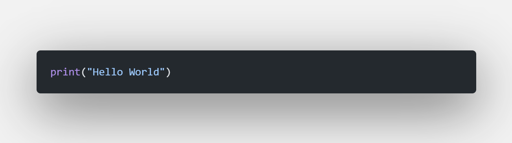

# Happy new year！！

# 👋 Hi I'm akaz.

  
❤️ I love Python.  
❤️‍🩹  I'm bad at game engine.  

  
推し: Git

  <code>$ git init
$ git add .
$ git commit -m"First Commit"
$ git push origin main</code>

# 📮 Contact me
* [X](https://twitter.com/akazdayo)
* [E-Mail](mailto:akaz_dango@tutanota.com)

# 📈 Stats

